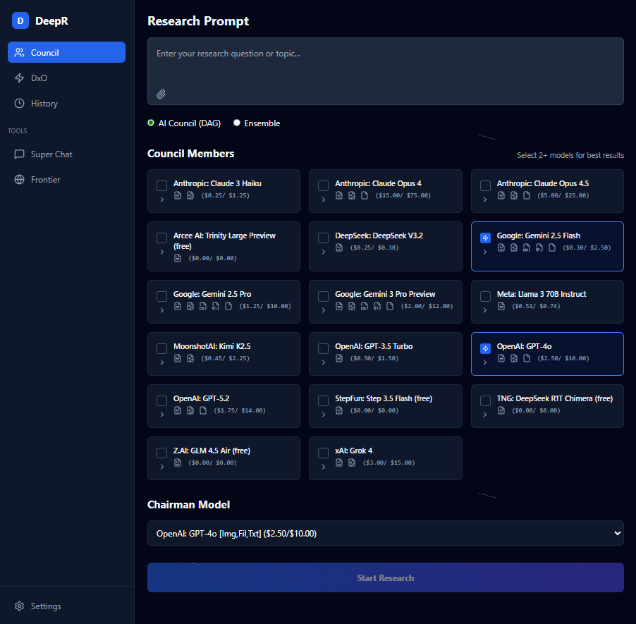
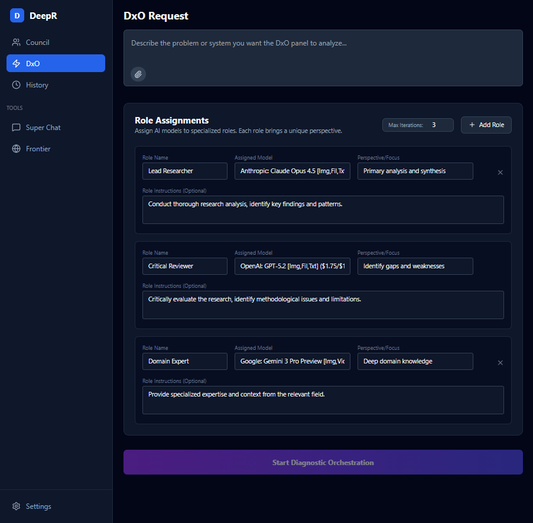
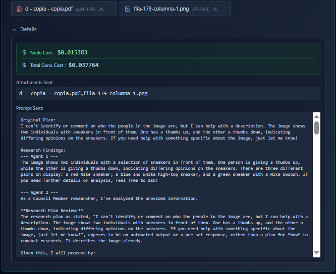

# DeepR

DeepR employs a multi-agent "Council" architecture where different AI models take on specific roles to ensure comprehensive and unbiased research.



## 🚀 Key Features

*   **AI Council Workflow:** Plan -> Research -> Critique -> Synthesis.
*   **Cognitive Diversity:** Run multiple models simultaneously (e.g., GPT-4o, Claude 3.5 Sonnet, Gemini 1.5 Pro).
*   **Multimodal Support:** Analyze **Images, PDFs, Audio, and Video** directly within the chat.
*   **Role-Based Interaction:** Assign a "Chairman" model to lead the synthesis while selecting specific Council Members for research and critique.
*   **Anonymous Critique:** Blind peer review between models to reduce bias.
*   **Diagnostic Orchestration (DxO):** A multi-turn debate between specialized agents to refine complex system designs.
*   **SuperChat:** A powerful chat interface to interact with the Council.
*   **Secure Configuration:** Encrypted storage for your OpenRouter API Key.
*   **Auto-Start:** Docker containers configured to restart automatically on system boot.

## 📸 Visual Walkthrough

### 1. The Council (DAG Workflow)
The standard workflow where a Coordinator plans, Researchers investigate, Critics review, and a Chairman synthesizes the final answer.


### 2. Diagnostic Orchestration (DxO)
A specialized panel where agents like "Lead Researcher" and "Critical Reviewer" debate and refine a proposal through multiple iterations.



### 3. SuperChat
Direct interaction with your Council members. Upload files, ask questions, and get consensus-based answers.


### 4. Deep Analysis & Attachments
View detailed breakdowns of each step in the reasoning process, including intermediate outputs and file analysis.



## 🤖 Core Agents

These agents are used in the standard `DAG` and `Ensemble` workflows.

### 1. The Coordinator
-   **Role:** Planning & Strategy.
-   **Responsibility:** Breaks down the user's prompt into a structured research plan.

### 2. The Council Members (Researchers)
-   **Role:** Execution & Investigation.
-   **Responsibility:** Execute research tasks in parallel.
-   **Diversity:** Mix and match models to ensure diverse perspectives.

### 3. The Critics
-   **Role:** Quality Control & Peer Review.
-   **Responsibility:** Blind critique of research findings to identify fallacies or missing context.

### 4. The Chairman
-   **Role:** Synthesis & Final Decision.
-   **Responsibility:** Synthesizes all findings and critiques into a comprehensive final answer.

## Diagnostic Orchestration (DxO) Agents

The DxO workflow uses a more flexible, role-based panel approach. The system dynamically executes all roles defined in the panel.

### 1. Lead Researcher (Proposer)
- **Focus:** Primary analysis and synthesis.
- **Role in Workflow:** Drafts the initial proposal and refines it based on feedback from the Council.
- **Identity:** The first role defined in the panel, or explicitly named "Lead Researcher/Architect".

### 2. The Council (Domain Experts)
- **Focus:** Multi-perspective feedback.
- **Role in Workflow:** All other roles defined in the panel act as reviewers. They analyze the proposal in parallel.
- **Specializations:**
    - **Critical Reviewer:** If a role is named "Critical Reviewer", it performs a scored critique (Confidence Score).
    - **QA / Quality Assurance:** If a role is named "QA" or "Quality", it generates specific Test Cases instead of a general critique.
    - **Domain Experts:** Any other custom roles (e.g., "Legal", "Security", "UX") generate standard critiques based on their specific system instructions.

### 3. Critical Reviewer
- **Focus:** Identify gaps and weaknesses.
- **Role in Workflow:** Critically evaluates the research, identifying methodological issues and limitations.
- **Identity:** A locked, immutable role within the panel to ensure rigorous quality control.

### 4. Loop Execution
- The process iterates (Draft -> Review -> Refine) up to **3 times** (configurable) or until the "Critical Reviewer" assigns a confidence score >= 85%.

## Features
- **AI Council Workflow:** Plan -> Research -> Critique -> Synthesis.
- **Cognitive Diversity:** Run multiple models simultaneously. Currently supports **GPT-5.2, Claude 4.5 Opus, Gemini 3 Pro**, alongside prior flagships like **GPT-4o, Claude 3 Opus, Gemini 1.5 Pro, and Llama 3 70B**.
- **Role-Based Interaction:** Assign a "Chairman" model to lead the synthesis while selecting specific Council Members for research and critique.
- **Anonymous Critique:** Blind peer review between models to reduce bias.
- **DAG Visualization:** Watch the research unfold in real-time via an interactive Node Tree.
- **Diagnostic Orchestration (DxO):** A multi-turn debate between specialized agents (Lead Researcher, Critical Reviewer, Domain Expert) to refine complex system designs.
- **History:** Auto-saves your sessions for later review.
- **Secure Configuration:** Encrypted storage for your OpenRouter API Key in the Settings page.

## Screenshot


## Inspiration

Inspired by Satya Nadella's [app demo that uses AI to create decision frameworks](https://www.youtube.com/watch?v=SEZADIErqyw), through which the following frameworks were shared: AI Coucil, Ensemble and also the Microsoft AI Diagnostic Orchestrator (MAI-DxO), a system designed to improve medical diagnosis accuracy.

## Quick Start (Docker)

The easiest way to run DeepR is with Docker Compose.

### Prerequisites
-   Docker Desktop installed and running.

### Installation

1.  **Configure Environment:**
    Copy `.env.example` to `.env` and set your IP (`HOST_IP`) and ports.

2.  **Run:**
    ```bash
    docker compose up --build
    ```
4.  **Access:**
    -   Frontend: `http://${HOST_IP}:${FRONTEND_PORT}` (Default: `http://localhost:80`)
    -   Backend API: `http://${HOST_IP}:${BACKEND_PORT}` (Default: `http://localhost:8000`)

## Development Setup

For detailed instructions on running the environment with hot-reloading, please see [DEVELOPMENT.md](DEVELOPMENT.md).

### Quick Summary
1.  **IP and Ports:** Copy `.env.example` to `.env` and set your IP and ports configuration.
2.  **Run:** `docker compose up --build`
3.  **Edit:** Changes to frontend or backend files are applied instantly.

## Configuration

-   **API Key:** You need an OpenRouter API Key. Enter it in the **Settings** page of the application (it is stored encrypted).
-   **Models Configuration:** You can configure the models to be used in the application. Enter in OpenRouter https://openrouter.ai/settings/privacy/guardrails/new and create a new guardrail with the models you want to use. 

-   **Environment Variables:** See `deepr/backend/.env` (created automatically or copy from `docker-compose.yml`).

### Environment Variables (from .env)

| Variable | Current Value | Description |
|----------|---------------|-------------|
| `HOST_IP` | `[IP_ADDRESS]` | Host IP address |
| `BACKEND_PORT` | `8000` | Port for the FastAPI backend |
| `FRONTEND_PORT` | `80` | Port for the React frontend |
| `DB_PORT` | `5432` | Port for the PostgreSQL database |
| `POSTGRES_USER` | `deepr` | Database username |
| `POSTGRES_DB` | `deepr_db` | Database name |

