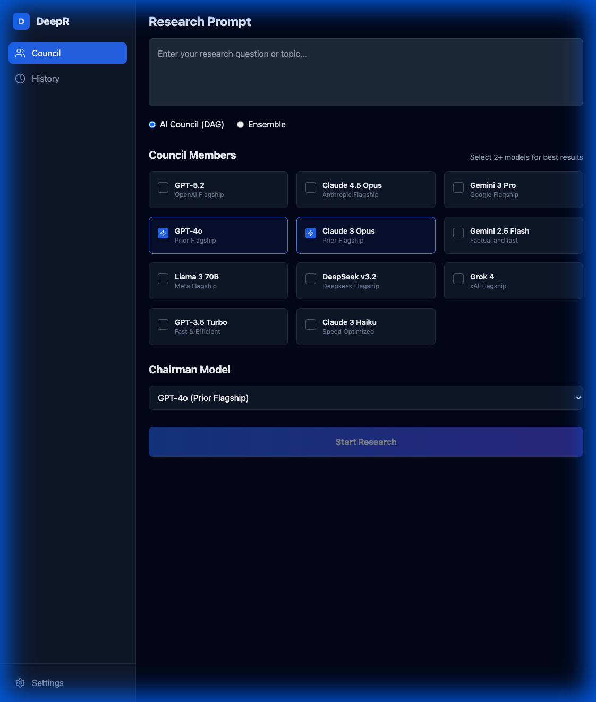

# DeepR

DeepR employs a multi-agent "Council" architecture where different AI models take on specific roles to ensure comprehensive and unbiased research.

## Core Agents (DAG Workflow)

These agents are used in the standard `DAG` and `Ensemble` workflows.

### 1. The Coordinator
- **Role:** Planning & Strategy.
- **Responsibility:** Receives the user's initial prompt and breaks it down into a structured research plan. It identifies key questions to investigate and assigns them to the Researchers.
- **Model:** Typically a high-reasoning model (e.g., GPT-4o).

### 2. The Council Members (Researchers)
- **Role:** Execution & Investigation.
- **Responsibility:** Each member executes the research tasks assigned by the Coordinator. They work in parallel to gather information, analyze data, and generate initial findings.
- **Diversity:** Users can select multiple different models (e.g., Claude 3 Opus, Llama 3) to ensure cognitive diversity and reduce single-model bias.

### 3. The Critics
- **Role:** Quality Control & Peer Review.
- **Responsibility:** They review the findings of the Researchers. The critique process is **blind** (anonymized) to prevent bias based on the identity of the researching model. They point out logical fallacies, missing context, or weak arguments.

### 4. The Chairman
- **Role:** Synthesis & Final Decision.
- **Responsibility:** The Chairman reads the original plan, the research findings, and the critiques. It then synthesizes everything into a final, comprehensive answer for the user.
- **Nature:** Acts as the final arbiter and voice of the Council.

## Diagnostic Orchestration (DxO) Agents

The DxO workflow uses a more flexible, role-based panel approach. The system dynamically executes all roles defined in the panel.

### 1. Lead Researcher (Proposer)
- **Focus:** Primary analysis and synthesis.
- **Role in Workflow:** Drafts the initial proposal and refines it based on feedback from the Council.
- **Identity:** The first role defined in the panel, or explicitly named "Lead Researcher/Architect".

### 2. The Council (Domain Experts)
- **Focus:** Multi-perspective feedback.
- **Role in Workflow:** All other roles defined in the panel act as reviewers. They analyze the proposal in parallel.
- **Specializations:**
    - **Critical Reviewer:** If a role is named "Critical Reviewer", it performs a scored critique (Confidence Score).
    - **QA / Quality Assurance:** If a role is named "QA" or "Quality", it generates specific Test Cases instead of a general critique.
    - **Domain Experts:** Any other custom roles (e.g., "Legal", "Security", "UX") generate standard critiques based on their specific system instructions.

### 3. Critical Reviewer
- **Focus:** Identify gaps and weaknesses.
- **Role in Workflow:** Critically evaluates the research, identifying methodological issues and limitations.
- **Identity:** A locked, immutable role within the panel to ensure rigorous quality control.

### 4. Loop Execution
- The process iterates (Draft -> Review -> Refine) up to **3 times** (configurable) or until the "Critical Reviewer" assigns a confidence score >= 85%.

## Features
- **AI Council Workflow:** Plan -> Research -> Critique -> Synthesis.
- **Cognitive Diversity:** Run multiple models simultaneously. Currently supports **GPT-5.2, Claude 4.5 Opus, Gemini 3 Pro**, alongside prior flagships like **GPT-4o, Claude 3 Opus, Gemini 1.5 Pro, and Llama 3 70B**.
- **Role-Based Interaction:** Assign a "Chairman" model to lead the synthesis while selecting specific Council Members for research and critique.
- **Anonymous Critique:** Blind peer review between models to reduce bias.
- **DAG Visualization:** Watch the research unfold in real-time via an interactive Node Tree.
- **Diagnostic Orchestration (DxO):** A multi-turn debate between specialized agents (Lead Researcher, Critical Reviewer, Domain Expert) to refine complex system designs.
- **History:** Auto-saves your sessions for later review.
- **Secure Configuration:** Encrypted storage for your OpenRouter API Key in the Settings page.

## Screenshot



## Inspiration

Inspired by Satya Nadella's [app demo that uses AI to create decision frameworks](https://www.youtube.com/watch?v=SEZADIErqyw), through which the following frameworks were shared: AI Coucil, Ensemble and also the Microsoft AI Diagnostic Orchestrator (MAI-DxO), a system designed to improve medical diagnosis accuracy.

## Quick Start (Docker)

The easiest way to run DeepR is with Docker Compose.

1.  **Prerequisites:** Install Docker and Docker Compose.
2.  **Run:**
    ```bash
    docker compose up --build
    ```
3.  **Access:**
    -   Frontend: `http://localhost:80`
    -   Backend API: `http://localhost:8000`

## Development Setup

For detailed instructions on running the environment with hot-reloading, please see [DEVELOPMENT.md](DEVELOPMENT.md).

### Quick Summary
1.  **Run:** `docker compose up --build`
2.  **Edit:** Changes to frontend or backend files are applied instantly.

## Configuration

-   **API Key:** You need an OpenRouter API Key. Enter it in the **Settings** page of the application (it is stored encrypted).
-   **Environment Variables:** See `deepr/backend/.env` (created automatically or copy from `docker-compose.yml`).
